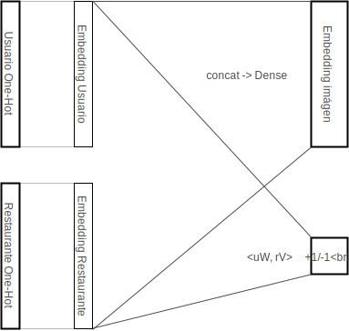
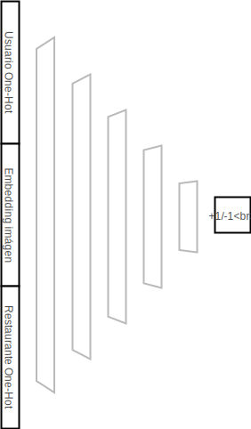

# 1.-Arquitecturas

En todos los casos se utiliza el optimizador **Adam**.

## 1.1 Arquitectura V1 (13/09/2018)
### 1.1.1 Descripción
Utilizando solamente aquellas reviews que posean imágen, se entrenaría un modelo con la siguiente arquitectura:

##### Entrada:
* Usuario (`one-hot`)
* Restaurante (`one-hot`)

##### Salida:
* Clasificación binaria (`DOT` con embeddings de usr y rest)
* Multiregresión (Concatenar embeddings y transfomar a espacio de imágenes)
 
### 1.1.2 Características
* Loss: `c·MSE + (1-c)·BIN_XENTROPY`
* Embedding de imágenes procedente de 3 formas de métodos posibles:
	* Autoencoder
	* Red preentrenada (InceptionResNetV2) 
	* Fine-Tuning de red preentrenada añadiendo clasificación binaria a la salida y usuario a la entrada.
* Loss de imágenes (`MSE`) normalizada (dividida entre la `MSE` media de todas las imágenes con la imagen centrioide). Esto es necesario para que la loss de la clasificación y la de la multiregresión se muevan en rangos de valores similares.
* Oversampling en TRAIN
* `c` en loss

### 1.1.3 Problemas
* Pocas reviews con imágen.
* Mayoría de usuarios con una sola review.
* División `TRAIN`/`DEV`/`TEST` compleja.

___
## 1.2 Arquitectura V2 (21/09/2018)
### 1.2.1 Descripción
Utilizando las valoraciones de aquellos **usuarios con 10 o más**, se entrenaría un modelo con la siguiente arquitectura:

##### Entrada:
* Usuario (`one-hot`)
* Imágen (Embedding obtenido mediante cualquiera de las 3 formas del punto 1.2)
* Restaurante (`one-hot`)

##### Salida:
* Clasificación binaria (Red profunda con 5 capas (ReLu) con tamaño de capa `n=(n-1)/2`)

### 1.2.2 Funcionamiento

Se dividirá el proceso de aprendizaje en dos fases:
##### Fase 1:
En esta fase se entrena el modelo con todas las reviews disponibles (se coloca un vector de 0's en el vector de la imágen independientemente de si tienen o no imagen real).
Para crear los conjuntos de `TRAIN`/`DEV`/`TEST` se realiza el siguiente procedimiento:

* Agrupar las reviews **con imágen** por usuario-restaurante y separar aleatoriamente `0.9`,`0.05`,`0.05`
* Agrupar las reviews **sin imágen** por usuario-restaurante y separar aleatoriamente `0.9`,`0.05`,`0.05`
* Tener en cuenta que un usuario puede tener varias reviews en un restaurante (una con imágen y otra sin ella) 

##### Fase 2:
En la segunda fase se refina el modelo anterior **partiendo de los pesos aprendidos en la fase 1 (sin fijarlos)** con la idea de ver si mejora la clasificación al añadir las imágenes.

Se ha de entrenar con un **learning-rate menor `lr/2` al de la fase 1** para evitar cambios bruscos que alteren en gran medida lo aprendido previamente.

El **conjunto de datos** ha de ser exactamente el mismo **de la fase 1** pero en el **TRAIN** hay que eliminar auquellas valoraciones **sin imágenes**.

### 1.2.3 Características
* Loss: `BIN_XENTROPY`
* Embedding de imágenes procedente de 3 formas de métodos posibles:
	* Autoencoder
	* Red preentrenada (InceptionResNetV2) 
	* Fine-Tuning de red preentrenada añadiendo clasificación binaria a la salida y usuario a la entrada.
* Oversampling en TRAIN
* Sin `c` en loss

### 1.2.4 Cambios
* El tamaño de las capas ocultas pasa a ser `4096 , 2048 , 1024 , 512 , 256` con el fin de reducir parámetros.
* Se pasa a usuarios con 5 (en vez de 10) o más reviews para evitar reducir en gran medida el conjunto.

### 1.2.5 Problemas
Este modelo **no modifica la representación de usuarios y restaurantes en función de las imágenes**. Estas se tienen en cuenta para la clasificación pero no en los embeddings.
___
## 1.3 Arquitectura V3 (24/09/2018)
### 1.3.1 Descripción
Esta aquitectura es idéntica a la anterior con la salvedad del modelo a utilizar. En este caso el nuevo modelo es:

##### Entrada:
* Usuario (`one-hot`)
* Restaurante (`one-hot`)

##### Salida:
* Clasificación binaria (`DOT` con embeddings de usr y rest)
* Multiregresión (Concatenar embeddings y transfomar a espacio de imágenes)
 ___
 
# 2.-Experimentación

## 2.1 Grid-Search [24/01/2018] (fase 1)
Utilizando las arquitecturas v2 y v3 se procede inicialmente a realizar un `Grid-Search` para cada uno de los modelos.
* Inicialmente, el `batch-size` **no se considera** como un hiperparámetro a optimizar y se fija en 512.
* Se prueba para ambos modelos unos `learning-rates` salteados  con el fin de ver en que rangos funciona mejor el modelo y realizar posteriormente otra ejecución con estos valores.
* En cuanto al `emb-size` se probarán los valores: 512,1024,2048 (solo en el modelo v3 dado que el v2 no posee embeddings como tal)
* Se realizará un **early-stopping** utilizando las **10** epochs anteriores deteniendose en el caso de que la pendiente sea mayor que **-1e-8**.
* El máximo de epochs establecido en todas las pruebas es de **5000**.
### 2.1.1 Resultados
En el **modelo v2** se retornan los siguientes resultados:

| Learning Rate |   DEV loss  | Epochs |
|:-------------:|:-----------:|:------:|
|    1.00E-07   | 0.555192433 |    140 |
|    1.00E-05   | 0.958121745 |     10 |
|    1.00E-03   | 1.262997863 |     10 |
|    1.00E-01   | 3.165766139 |     10 |

Estos resultados parecen indicar que es necesaria una nueva ejecución con `learning-rates` menores o en torno a **1e-7**.

## Cambios [02/01/2018]
Se descarta el Grid-Seach anterior.  
Utilizando las arquitecturas v2 y v3 se procede inicialmente a realizar un `Random-Search` para cada uno de los modelos.
* Se utilizarán para ambos modelos 5 `learning-rates`: (1e-9, 1e-7, 1e-5, 1e-3, 1e-1).
* En cuanto al `emb-size` se probarán 4 valores en el intervalo `[128,256,512,1024]` (solo en el modelo v3 dado que el v2 no posee embeddings como tal)

El `batch-size` **no se considera** como un hiperparámetro a optimizar y se fija en 512.  

El máximo de epochs establecido en todas las pruebas es de **500**.  

#### Acelerar la búsqueda de hiperparámetros
Dada la baja velocidad, se deciden implementar los siguientes cambios:

* Se pasa de un `OverSampling` de proporciones 50/50 a utilizar todos los de clase 1 , todos los de clase cero y finalmente otros tantos de clase 0 como los ya existentes (escogidos de forma aleatoria)
* Reducir los tamaños de las capas del modelo 2 (1024/512/256/128/64)
* Se realizará un **early-stopping** utilizando las **7** epochs anteriores deteniendose en el caso de que la pendiente sea mayor que **-1e-8**.  
* Si la loss entre las 2 primeras epochs es exactamente igual, detener.

## Cambios [03/01/2018]
* El early stopping se realizará esperando 5 epochs y utilizando las 5 siguientes. Como mínimo se realizarán 10 epochs a no ser que no exista mejora alguna.
* La métrica a utilizar durante la fase de búsqueda de hiperparámetros será el `Area Under ROC` .
* En el modelo V2 se realizará un `grid-search` variando:
    * Learning-rate: `(1e-1, 1e-3, 1e-5, 1e-7, 1e-9)`
* En el modelo V3 se realizará nuevamente un `grid-search` variando:
    * Learning-rate: `(1e-1, 1e-3, 1e-5)`
    * Embedding: `(256,512)`
