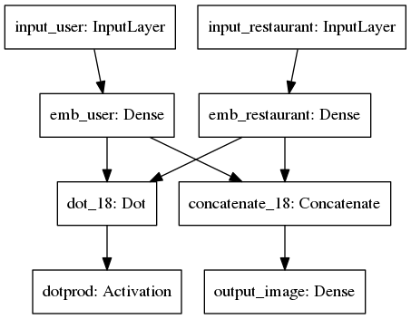
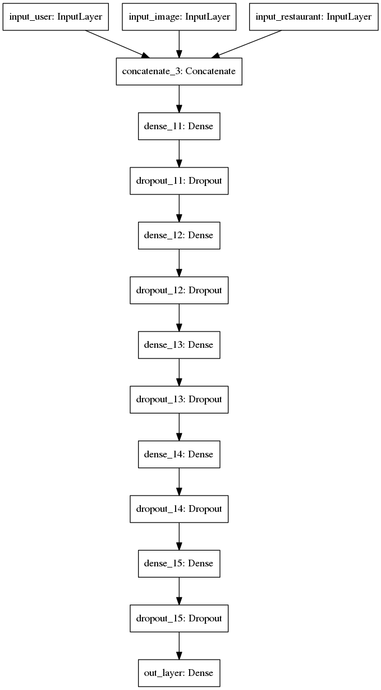

# 1.-Arquitecturas

En todos los casos se utiliza el optimizador **Adam**.

## 1.1 Arquitectura V1 (13/09/2018)
### 1.1.1 Descripción
Utilizando solamente aquellas reviews que posean imágen, se entrenaría un modelo con la siguiente arquitectura:

##### Entrada:
* Usuario (`one-hot`)
* Restaurante (`one-hot`)

##### Salida:
* Clasificación binaria (`DOT` con embeddings de usr y rest)
* Multiregresión (Concatenar embeddings y transfomar a espacio de imágenes)
 
### 1.1.2 Características
* Loss: `c·MSE + (1-c)·BIN_XENTROPY`
* Embedding de imágenes procedente de 3 formas de métodos posibles:
	* Autoencoder
	* Red preentrenada (InceptionResNetV2) 
	* Fine-Tuning de red preentrenada añadiendo clasificación binaria a la salida y usuario a la entrada.
* Loss de imágenes (`MSE`) normalizada (dividida entre la `MSE` media de todas las imágenes con la imagen centrioide). Esto es necesario para que la loss de la clasificación y la de la multiregresión se muevan en rangos de valores similares.
* Oversampling en TRAIN
* `c` en loss

### 1.1.3 Problemas
* Pocas reviews con imágen.
* Mayoría de usuarios con una sola review.
* División `TRAIN`/`DEV`/`TEST` compleja.

___
## 1.2 Arquitectura V2 (21/09/2018)
### 1.2.1 Descripción
Utilizando las valoraciones de aquellos **usuarios con 10 o más**, se entrenaría un modelo con la siguiente arquitectura:

##### Entrada:
* Usuario (`one-hot`)
* Imágen (Embedding obtenido mediante cualquiera de las 3 formas del punto 1.2)
* Restaurante (`one-hot`)

##### Salida:
* Clasificación binaria (Red profunda con 5 capas (ReLu) con tamaño de capa `n=(n-1)/2`)

### 1.2.2 Funcionamiento

Se dividirá el proceso de aprendizaje en dos fases:
##### Fase 1:
En esta fase se entrena el modelo con todas las reviews disponibles (se coloca un vector de 0's en el vector de la imágen independientemente de si tienen o no imagen real).
Para crear los conjuntos de `TRAIN`/`DEV`/`TEST` se realiza el siguiente procedimiento:

* Agrupar las reviews **con imágen** por usuario-restaurante y separar aleatoriamente `0.9`,`0.05`,`0.05`
* Agrupar las reviews **sin imágen** por usuario-restaurante y separar aleatoriamente `0.9`,`0.05`,`0.05`
* Tener en cuenta que un usuario puede tener varias reviews en un restaurante (una con imágen y otra sin ella) 

##### Fase 2:
En la segunda fase se refina el modelo anterior **partiendo de los pesos aprendidos en la fase 1 (sin fijarlos)** con la idea de ver si mejora la clasificación al añadir las imágenes.

Se ha de entrenar con un **learning-rate menor `lr/2` al de la fase 1** para evitar cambios bruscos que alteren en gran medida lo aprendido previamente.

El **conjunto de datos** ha de ser exactamente el mismo **de la fase 1** pero en el **TRAIN** hay que eliminar auquellas valoraciones **sin imágenes**.

### 1.2.3 Características
* Loss: `BIN_XENTROPY`
* Embedding de imágenes procedente de 3 formas de métodos posibles:
	* Autoencoder
	* Red preentrenada (InceptionResNetV2) 
	* Fine-Tuning de red preentrenada añadiendo clasificación binaria a la salida y usuario a la entrada.
* Oversampling en TRAIN
* Sin `c` en loss

### 1.2.4 Cambios
* El tamaño de las capas ocultas pasa a ser `4096 , 2048 , 1024 , 512 , 256` con el fin de reducir parámetros.
* Se pasa a usuarios con 5 (en vez de 10) o más reviews para evitar reducir en gran medida el conjunto.

### 1.2.5 Problemas
Este modelo **no modifica la representación de usuarios y restaurantes en función de las imágenes**. Estas se tienen en cuenta para la clasificación pero no en los embeddings.
___
## 1.3 Arquitectura V3 (24/09/2018)
### 1.3.1 Descripción
Esta aquitectura es idéntica a la anterior con la salvedad del modelo a utilizar. En este caso el nuevo modelo es:

##### Entrada:
* Usuario (`one-hot`)
* Restaurante (`one-hot`)

##### Salida:
* Clasificación binaria (`DOT` con embeddings de usr y rest)
* Multiregresión (Concatenar embeddings y transfomar a espacio de imágenes)
 ___
 
# 2.-Experimentación

## 2.1 Grid-Search [24/10/2018] (fase 1)
Utilizando las arquitecturas v2 y v3 se procede inicialmente a realizar un `Grid-Search` para cada uno de los modelos.
* Inicialmente, el `batch-size` **no se considera** como un hiperparámetro a optimizar y se fija en 512.
* Se prueba para ambos modelos unos `learning-rates` salteados  con el fin de ver en que rangos funciona mejor el modelo y realizar posteriormente otra ejecución con estos valores.
* En cuanto al `emb-size` se probarán los valores: 512,1024,2048 (solo en el modelo v3 dado que el v2 no posee embeddings como tal)
* Se realizará un **early-stopping** utilizando las **10** epochs anteriores deteniendose en el caso de que la pendiente sea mayor que **-1e-8**.
* El máximo de epochs establecido en todas las pruebas es de **5000**.
### 2.1.1 Resultados
En el **modelo v2** se retornan los siguientes resultados:

| Learning Rate |   DEV loss  | Epochs |
|:-------------:|:-----------:|:------:|
|    1.00E-07   | 0.555192433 |    140 |
|    1.00E-05   | 0.958121745 |     10 |
|    1.00E-03   | 1.262997863 |     10 |
|    1.00E-01   | 3.165766139 |     10 |

Estos resultados parecen indicar que es necesaria una nueva ejecución con `learning-rates` menores o en torno a **1e-7**.

## Cambios [02/10/2018]
Se descarta el Grid-Seach anterior.  
Utilizando las arquitecturas v2 y v3 se procede inicialmente a realizar un `Random-Search` para cada uno de los modelos.
* Se utilizarán para ambos modelos 5 `learning-rates`: (1e-9, 1e-7, 1e-5, 1e-3, 1e-1).
* En cuanto al `emb-size` se probarán 4 valores en el intervalo `[128,256,512,1024]` (solo en el modelo v3 dado que el v2 no posee embeddings como tal)

El `batch-size` **no se considera** como un hiperparámetro a optimizar y se fija en 512.  

El máximo de epochs establecido en todas las pruebas es de **500**.  

#### Acelerar la búsqueda de hiperparámetros
Dada la baja velocidad, se deciden implementar los siguientes cambios:

* Se pasa de un `OverSampling` de proporciones 50/50 a utilizar todos los de clase 1 , todos los de clase cero y finalmente otros tantos de clase 0 como los ya existentes (escogidos de forma aleatoria)
* Reducir los tamaños de las capas del modelo 2 (1024/512/256/128/64)
* Se realizará un **early-stopping** utilizando las **7** epochs anteriores deteniendose en el caso de que la pendiente sea mayor que **-1e-8**.  
* Si la loss entre las 2 primeras epochs es exactamente igual, detener.

## Cambios [03/10/2018]
* El early stopping se realizará esperando 5 epochs y utilizando las 5 siguientes. Como mínimo se realizarán 10 epochs a no ser que no exista mejora alguna.
* La métrica a utilizar durante la fase de búsqueda de hiperparámetros será el `Area Under ROC` del conjunto de validación.
* En el modelo V2 se realizará un `grid-search` variando:
    * Learning-rate: `(1e-1, 1e-3, 1e-5, 1e-7, 1e-9)`
* En el modelo V3 se realizará nuevamente un `grid-search` variando:
    * Learning-rate: `(1e-1, 1e-3, 1e-5)`
    * Embedding: `(256,512)`

### Resultados
#### Modelo v1
|    LR    | AUC-ROC | Epochs |
|:--------:|:-------:|:------:|
| 1,00E-09 |  0,4976 |     33 |
| 1,00E-07 |  0,6992 |    404 |
| 1,00E-06 |  0,7092 |    126 |
| 1,00E-05 |  0,6463 |     10 |
| 1,00E-03 |  0,5000 |      2 |
| 1,00E-01 |  0,5000 |      2 |

#### Modelo v2

|          |    EMB   |        |         |        |         |        |          |        |
|:--------:|:--------:|:------:|---------|--------|---------|--------|----------|--------|
|          |      **128** |        | **256**     |        | **512**     |        | **1024**     |        |
|    **LR**    |  **AUC-ROC** | **EPOCHS** | **AUC-ROC** | **EPOCHS** | **AUC-ROC** | **EPOCHS** | **AUC-ROC**  | **EPOCHS** |
| 1,00E-07 | 0,542115 |    500 | 0,4671  | 32     | 0,6023  | 500    | 0,615969 | 500    |
| 1,00E-05 | 0,660177 |     24 | 0,6691  | 16     | 0,6632  | 15     | 0,659717 | 13     |
| 1,00E-03 | 0,713721 |     24 | 0,6907  | 21     | 0,6872  | 17     | 0,690673 | 16     |
| 1,00E-01 |      0,5 |      2 | 0,5000  | 2      | 0,5000  | 2      | 0,5      | 2      |

## Cambios [04/10/2018]
Analizando los resultados y probando a realizar entrenamientos con parámetros concretos se ve que existe un alto sobreajuste en TRAIN.
Para evitar esto y mejorar los resutados en DEV, se deciden los siguientes cambios:

* Añadir `DropOut` en las 5 capas intermedias del modelo v2 y en los embeddings previa realización del producto escalar en el modelo v3.
* Cambio del tamaño del batch de 512 a 128 con el fin de reducir el número de epochs y no alcanzar el máximo establecido (500)
* Gridsearch con mejores valores y dropout de 0.5.
* Probar con oversampling con y sin dropout y sin oversampling con y sin dropout
* Asegurarse del funcionamiento del dropout en el modelo v3

#### Resultados

Ver fichero `docs/04_10_2018.xlsx`

## Cambios [10/10/2018]

Se añade el cálculo de la métrica AUC (en DEV y TRAIN) utilizando las probabilidades binarizadas de antemano para evitar resutados "muy optimistas" y cambios de AUC ante la misma matriz de confusión.

## Cambios [11/10/2018]
Ante los problemas vistos utilizando el AUC, se vuelve a realizar la optimización de hiperparámetros utilizando la **loss** en DEV `binary_crossentropy`.

Se realizará un nuevo Grid-Search utilizando los siguientes parámetros:

### Modelo 2

* **LR**: [1e-4, 1e-5, 1e-6, 1e-7, 1e-8, 1e-9]
* **DPOUT**: No
* **OVERSAMPLING**: Duplicar ejemplos de la clase 0. 

### Modelo 3

* **LR**:  [1e-3, 1e-5, 1e-7, 1e-9]
* **EMB**: [128, 256, 512, 1024]
* **DPOUT**: No
* **OVERSAMPLING**: Duplicar ejemplos de la clase 0. 

### Otros
Además de minimizar la loss en DEV, también se mostrará para cada epoch la siguiente información:
* AUC_TRAIN
* AUC_BIN_TRAIN
* TRAIN_LOSS
* AUC_DEV
* AUC_BIN_DEV
* DEV_LOSS (A minimizar)
* DEV_F1 (Seleccionando correctamente la clase minoritaria)
* DEV_ACCURACY ( TP+TN / TOTAL EJEMPLOS )
* TP
* FP
* FN
* TN

#### Resultados

Ver fichero `docs/11_10_2018.xlsx`

## Cambios [16/10/2018]
Analizando las epochs a fondo (batch a batch) (ver `docs/16_10_2018_batch.xml`) se descubrió un error en los datos de entrenamiento.
Los datos de la clase 1 y 0 no se encontraban mezclaban.

Se repiten los Grid-searchs con los datos mezclados.

Se añaden métodos para obtener más información sobre los conjuntos.
* Valoraciones por usuario (positivas, negativas y no valoradas)

#### Resultados

Ver fichero `docs/16_10_2018_gs.xml`

## Cambios [19/10/2018]
Se cambia la forma de separar datos y evaluar el modelo para adaptalo a un problema similar como el descrito por **Yehuda Koren** en **"Performance of Recommender Algorithms
on Top-N Recommendation Tasks"**.

### Generación de datos
Utilizar aquellos usuarios que tenagan como mínimo 5 reviews (positivas o negativas) **CON IMAGEN**.  

De los anteriores, aquellos que tengan como mínimo 5 (analisis de distribución de usuarios `docs/19_10_2018_stats.xlsx`) reviews positivas.  

* De todas las reviews positivas, separar para cada usuario `(3,1,1 => TRAIN, DEV, TEST)`.  
* Todas las negativas para TRAIN.
* Crear, para cada usuario, `n` (para compensar distribución de positivos 50/50) ejemplos negativos con los restaurantes no vistos por usuario.  
* En este caso `n = ((N_POSITIVOS_TRAIN - N_NEGATIVOS_TRAIN)/N_USUARIOS)+1`.

La razon de añadir nuevos elementos es reforzar la evaluación (ver apartado de evaluación).

Por tanto los conjuntos finales son:
* **TRAIN_V1**: Reviews separadas para TRAIN con la imágen puesta a 0
* **TRAIN_V2**: Reviews separadas para TRAIN con el embedding de la imágen.
* **DEV**: Reviews separadas para DEV y sin multiplicar por el número de imágenes
* **TEST**: Reviews separadas para TEST y sin multiplicar por el número de imágenes

### Evaluación
Para cada positivo de cada usuario en DEV o TRAIN, se escogen 1000 aleatorios no vistos y se consideran como negativos. Tras valorar cada uno de ellos se ordenan y se considera acierto si el item real está en el **TOP-N**.

Para obtener el precisión y recall, previo entrenamiento del modelo con los datos de TRAIN, para cada item `i` positivo de cada usuario:

* Se seleccionan 1000 items no vistos por el usuario (No se pueden añadir los ya añadidos en entrenamiento).
* Se obtiene la recomendación asociada a cada uno de los 1001 items y se ordenan de mayor a menor rating.
* Si el item positivo `i` se encuentra en el TOP-N de esa lista, se cuenta como un acierto.

#### Precision y Recall
Siendo `|T|` el número de positivos del conjunto de TEST y `N` el número de items del TOP-N:

* **Precision:** `precision(N): # hits/|T|`
* **Recall:**  `recall(N): recall(N)/N`

## Cambios [29/10/2018]

### Modelo

Se utiliza ahora solamente el modelo v3* (ahora v1), entrenado de la siguiente forma:
* Un batch solo con `valoraciones` para la parte de clasificación binaria.
* Un batch solo con `imagenes` para la parte de multiregresión.

De esta forma, se pretenede entrenar cada parte de forma independiente compartiendo la codificación de usuarios y restaurantes.  

En el futuro, es posible que se añada una tercera salida de la red con los comentarios en formato `D2V` o `LSTM` lo que implicariía otro paso más en el entrenamiento.

*se probó una versión con el producto escalar previamente, pero los resultados eran peores (Ver fichero `docs/29_10_2018/deep_vs_dot.xlsx`). También se probó la posibilidad de añadir capas ocultas o en la parte de clasificación binaria sin mejoras relevantes (Ver fichero `docs/29_10_2018/deep_hidden.xlsx`)

### Conjunto de datos
Usuarios con más de 5 revews positivas, separando de la siguiente forma:
* **TEST:** 1 review positiva + 1000  nuevas reviews (distintas de DEV y TRAIN)
* **DEV:** 1 review positiva  + 100 nuevas reviews (distintas de TRAIN)
* **TRAIN_V1:** Resto reviews positivas  + reviews negativas + n nuevas reviews para compensar distribución de 1s y 0s
* **TRAIN_V2:** Igual que TRAIN_V1 (sin n reviews nuevas) y sólo con imágenes

### Entrenamiento
Dos fases:
* Primera fase entrenado solamente la clasificación binaria con **TRAIN_V1**.
* Segunda fase entrenado la clasificación binaria con **TRAIN_V1** y la multiregresión con **TRAIN_V2**.

### Evaluación
Se mantiene la evaluación TOP-N anterior.

### Análisis de datos

* Se generó un gráfico para ver la proporción entre restaurantes y reviews emulando al de Koren. (Ver fichero `docs/29_10_2018/tail_graph.xlsx`)
* Para ver la distribución de ejemplos por usuario, se generó otro gráfico (Ver fichero `docs/29_10_2018/users_graph.xlsx`)

Analizando lo anterior, se realizan un cambios en la generación de datos descritos a continuación.

## Cambios [12/11/2018]

### Generación de datos
Utilizar aquellos usuarios que tenagan como mínimo 5 reviews (positivas o negativas).  
De los anteriores, aquellos que tengan como mínimo 5 reviews positivas.  

* De todas las reviews positivas, separar para cada usuario `(60%,20%,20% => TRAIN, DEV, TEST)`.  
* Todas las negativas para TRAIN.
* Crear, para cada usuario, `n` (para compensar distribución de positivos 50/50) ejemplos negativos con los restaurantes no vistos por usuario.  
* En este caso `n = ((N_POSITIVOS_TRAIN - N_NEGATIVOS_TRAIN)/N_USUARIOS)+1`.
